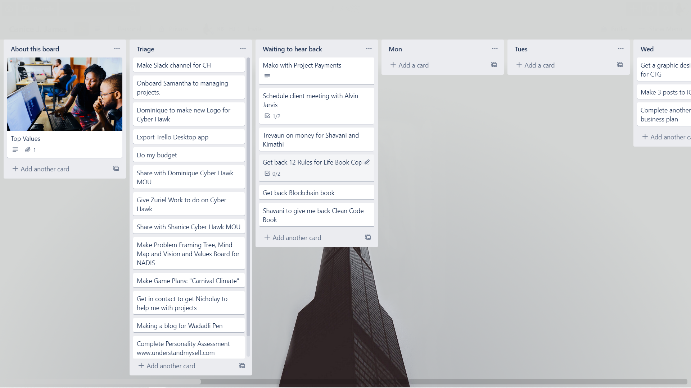
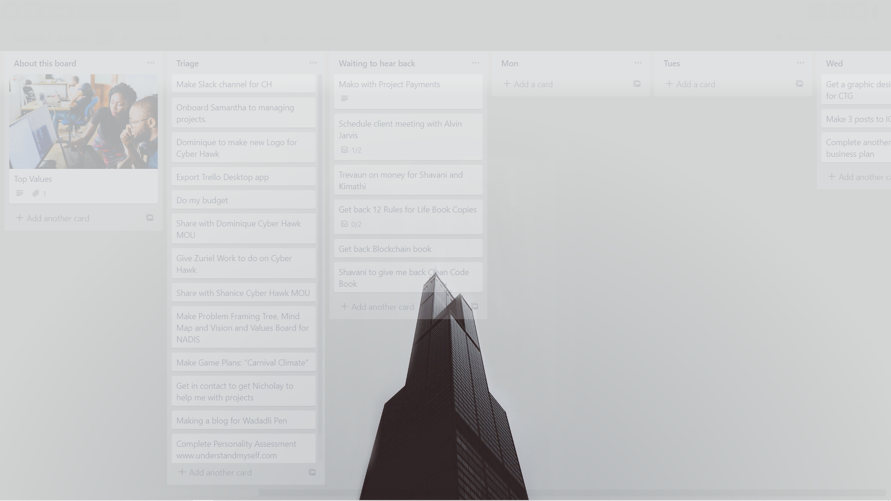
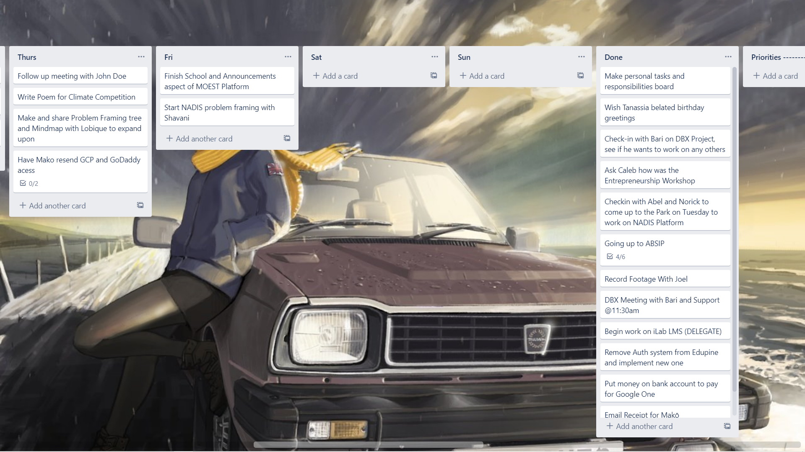
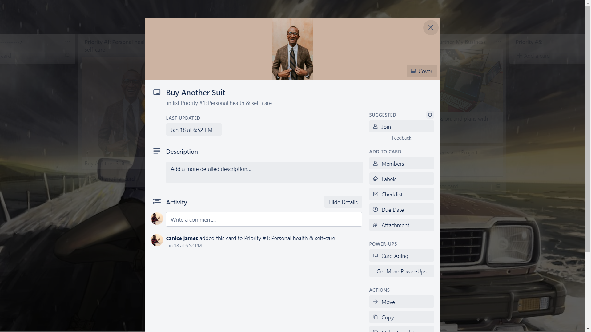

# Trello Immersive 

## Why?
> Because if task management is your day-to-day you might as well make it beautiful. For persons who almost always have Trello open and have a taste for aesthetics.

How to use?
> Login (without google login). Open your board. Do your thing.

For best use hide or clean up your desktop icons

Aesthetic
-------

-------
Gets out of your way when you're not focusing on it.

Superb for extra long boards
-------

All features and powerups works as usual
-------

